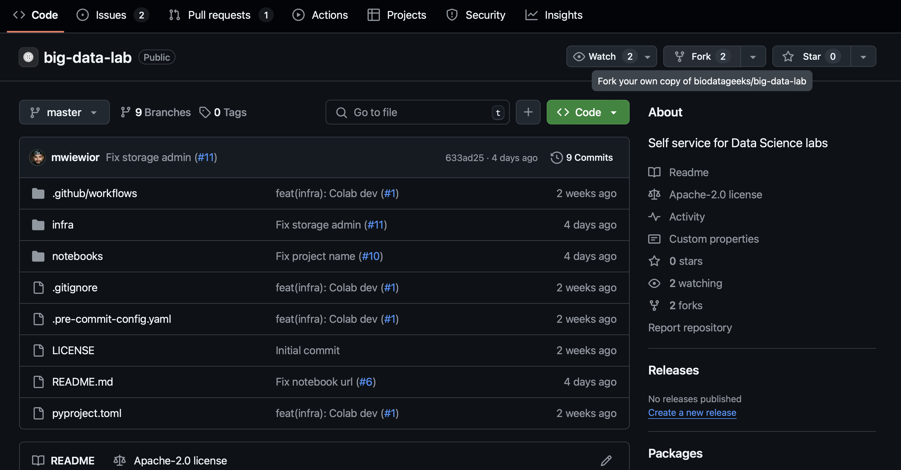

## How to use this repo

1. Fork this repo

2. Change parameters in `notebooks/conf/00_env_variables.ipynb`:
    - USER_ID - a number associated with your WUT email
    - TF_VAR_billing_account - billing account ID (GCP Console > Billing > Billing account ID)
3. Open the notebook `01_ds_lab_project_bootstrap.ipynb` on Colab by clicking the badge below
* Bootstrap GCP project [](https://colab.research.google.com/github/biodatageeks/ds-lab-infra/blob/master/notebooks/01_ds_lab_project_bootstrap.ipynb)
4. Run the notebook `02_ds_lab_infra_setup.ipynb` on Colab by clicking the badge
* Provision Big Data Lab resources [](https://colab.research.google.com/github/biodatageeks/ds-lab-infra/blob/master/notebooks/02_ds_lab_infra_setup.ipynb)
5. Change parameter in `notebooks/01_ds_lab_project_bootstrap.ipynb` and `notebooks/02_ds_lab_infra_setup.ipynb`:
    - USER_NAME - set to your GitHub username
6. Run both Colab notebooks.
7. Go to GCP Console > Dataproc > Workbench > Open JupyterLab.
8. Authenticate to GitHub using:
```
gh auth login
```
9. Fork the repo `https://github.com/biodatageeks/ds-notebooks.git`
10. Clone the repo:
```
USER_NAME=myGitHubUsername
git clone https://github.com/$USER_NAME/ds-notebooks.git
```
11. Run the session_1 notebooks.